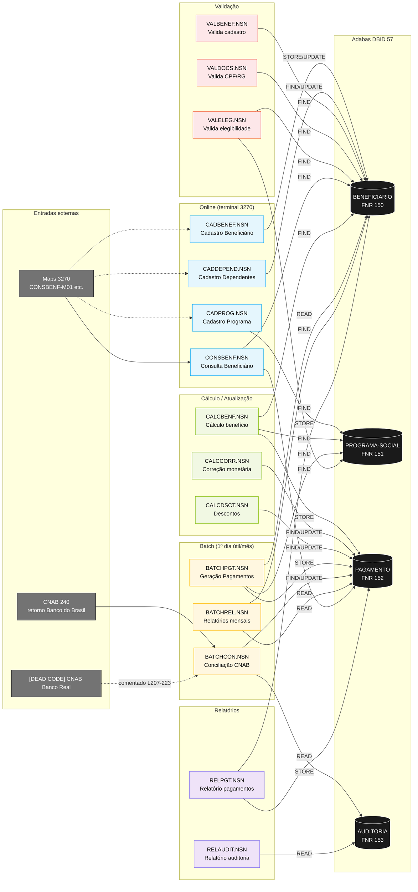
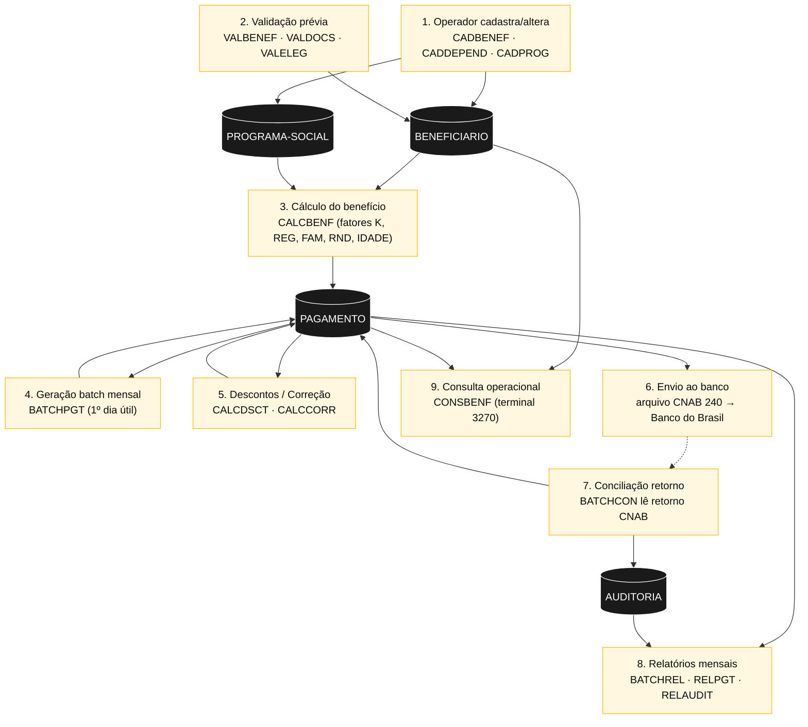

<!-- markdownlint-disable MD013 MD025 MD026 MD028 MD029 MD034 MD040 MD051 MD060 -->

# Mapa de Dependências — SIFAP Legado

  

> 🗺 **Você está aqui:** [Kit PT-BR](../README.md) → [Estágio 1](README.md) → **dependency-map**

> **Para quem é isto?** Este é um **artefato preenchido pelo time** durante o Estágio 1 (Arqueologia).
>
> **O que você terá ao final do estágio:**
>
> 1. Este documento totalmente preenchido com os dados reais do legado SIFAP
> 2. Rastreabilidade para `01-arqueologia/legado-sifap/` (programas `.NSN` e DDMs)
> 3. Base de evidência usada nas EARS do Estágio 2 (`source_legacy:`)
>
> 📘 **Guia passo a passo:** [`GUIDE.md`](GUIDE.md).

> Use diagramas Mermaid para mapear as dependências entre programas Natural e DDMs Adabas.
> O objetivo é visualizar "quem chama quem" e "quem lê/escreve o quê".

## Como descobrir dependências

- `grep` por `CALLNAT` nos 15 `.NSN` → **resultado: ZERO ocorrências**. Não há chamadas inter-programa.
- `grep` por `VIEW OF` → mapeia que DDM cada programa abre.
- `grep` por `READ`, `FIND`, `HISTOGRAM` → leitura.
- `grep` por `STORE`, `UPDATE`, `DELETE` → escrita.
- `grep` por `PERFORM` → subroutines **internas** (dentro do próprio `.NSN`), não dependência externa.
- `grep` por `DEFINE WORK FILE` / `INPUT USING MAP` → entradas externas (CNAB, terminal 3270).

## Descoberta Crítica — Acoplamento por Dados (não por código)

> **Resultado da varredura:** os 15 programas `.NSN` **não se chamam entre si**. Não existe `CALLNAT` no legado SIFAP.
>
> Cada programa é **monolítico**: declara suas próprias `VIEW OF`, abre e fecha sua própria transação Adabas. Subroutines (`PERFORM`) existem somente **dentro** do mesmo arquivo.
>
> **Onde está a dependência então?** Nos 4 DDMs Adabas compartilhados. Se duas pessoas mudarem `CALCBENF.NSN` e `BATCHPGT.NSN` no mesmo dia, o "chicote estala" porque ambos gravam em `PAGAMENTO` — mas o compilador Natural não detecta. Isto é **acoplamento implícito via banco**, o pesadelo clássico do monolito legado.

## Diagrama de Dependências — 15 Programas × 4 DDMs

## Diagrama de Fluxo de Dados (pipeline mensal)

## Tabela de Dependências (todos os 15 programas)

> **Coluna "Chama":** nenhuma chamada inter-programa via `CALLNAT` foi encontrada. A coluna lista subroutines **internas** (`PERFORM`) relevantes, que ajudam a entender a estrutura do programa.

| #   | Programa         | Chama (PERFORM interno)                                 | Lê DDMs (FIND/READ)              | Escreve DDMs (STORE/UPDATE)      | Entradas externas                | Observações                                                                          |
| --- | ---------------- | ------------------------------------------------------- | -------------------------------- | -------------------------------- | -------------------------------- | ------------------------------------------------------------------------------------ |
| 1   | `CADBENEF.NSN`   | `VALIDA-CPF` (L112)                                     | BENEFICIARIO                     | BENEFICIARIO                     | Map 3270                         | Cadastro online de titulares                                                         |
| 2   | `CADDEPEND.NSN`  | —                                                       | BENEFICIARIO                     | BENEFICIARIO (PE `GRP-DEPENDENTE`) | Map 3270                       | Manipula sub-registros periódicos                                                    |
| 3   | `CADPROG.NSN`    | `CONSULTA-PROG` (L57)                                   | PROGRAMA-SOCIAL                  | PROGRAMA-SOCIAL                  | Map 3270                         | Cadastra `FATOR-K` sem rastreabilidade — MYS-003                                     |
| 4   | `CONSBENF.NSN`   | `MASCARA-CPF` (L107)                                    | BENEFICIARIO, PAGAMENTO          | —                                | `INPUT USING MAP 'CONSBENF-M01'` | Consulta read-only                                                                   |
| 5   | `VALBENEF.NSN`   | `VALIDA-CPF-COMPLETO`, `VALIDA-DATA`, `VALIDA-NOME`     | BENEFICIARIO                     | —                                | —                                | Validação síncrona de cadastro                                                       |
| 6   | `VALDOCS.NSN`    | `VALIDA-CPF-DOC`, `VALIDA-RG`, `CHECK-DOC-ESPECIAL`     | BENEFICIARIO                     | —                                | —                                | Contém backdoor de CPFs especiais — Easter Egg 2                                     |
| 7   | `VALELEG.NSN`    | `VERIF-ELEG-ESPECIFICA` (L207)                          | BENEFICIARIO, PROGRAMA-SOCIAL    | —                                | —                                | Aplica regra `COD-REGIAO = 99` — MYS-008                                             |
| 8   | `CALCBENF.NSN`   | (cálculo inline dos 5 fatores)                          | BENEFICIARIO, PROGRAMA-SOCIAL    | PAGAMENTO (L286)                 | —                                | Núcleo de cálculo; produz `PAGAMENTO` para os batches; abono natalino (L260) — MYS-004 |
| 9   | `CALCCORR.NSN`   | `CALC-INDICE-ACUM` (L149)                               | PAGAMENTO                        | PAGAMENTO (L162)                 | Tabela IPCA hardcoded            | Correção monetária; UPDATE do mesmo registro lido                                    |
| 10  | `CALCDSCT.NSN`   | `CALC-CONTRIB-SOCIAL` (L99)                             | PAGAMENTO                        | PAGAMENTO (L181)                 | —                                | Aplica os 6 tipos de desconto                                                        |
| 11  | `BATCHPGT.NSN`   | `DET-FAIXA-RENDA-BATCH` (L262)                          | BENEFICIARIO, PROGRAMA-SOCIAL    | PAGAMENTO (L335)                 | JCL noturno (1º dia útil)        | Batch principal; lê BENEFICIARIO inteiro                                             |
| 12  | `BATCHCON.NSN`   | `GRAVA-AUDITORIA-DIVERG` (L167), `GRAVA-AUDITORIA-CONC` (L201) | PAGAMENTO, AUDITORIA, `WORK FILE 1` | PAGAMENTO, AUDITORIA      | `#ARQ-RETORNO` (CNAB 240)        | Conciliação bancária; código Banco Real comentado L207-223 — Easter Egg 3            |
| 13  | `BATCHREL.NSN`   | `IMPRIME-CABECALHO` (L172)                              | PAGAMENTO, BENEFICIARIO          | —                                | JCL noturno                      | Relatórios consolidados                                                              |
| 14  | `RELPGT.NSN`     | `IMPRIME-SUBTOTAL` (L94, L174), `IMPRIME-CABECALHO` (L145) | PAGAMENTO, BENEFICIARIO       | —                                | Parâmetros via PDA               | Filtra ações `EX` sem justificativa — MYS-010                                         |
| 15  | `RELAUDIT.NSN`   | `IMPRIME-CAB-AUDIT` (L165)                              | AUDITORIA                        | —                                | —                                | Único leitor da trilha de auditoria                                                  |

## Matriz de Acoplamento por DDM (quem mexe em quê)

> **Leitura:** cada coluna mostra todos os programas que tocam a DDM. Qualquer mudança de schema afeta TODOS os programas listados.

| DDM (FNR)                 | Escritores (STORE/UPDATE)                                            | Leitores (FIND/READ)                                                         | Total |
| ------------------------- | -------------------------------------------------------------------- | ---------------------------------------------------------------------------- | ----- |
| `BENEFICIARIO` (150)      | CADBENEF, CADDEPEND                                                  | VALBENEF, VALDOCS, VALELEG, CONSBENF, CALCBENF, BATCHPGT, BATCHREL, RELPGT   | 10    |
| `PROGRAMA-SOCIAL` (151)   | CADPROG                                                              | CALCBENF, BATCHPGT, VALELEG                                                  | 4     |
| `PAGAMENTO` (152)         | CALCBENF, CALCCORR, CALCDSCT, BATCHPGT, BATCHCON                     | BATCHREL, CONSBENF, RELPGT                                                   | 8     |
| `AUDITORIA` (153)         | BATCHCON                                                              | RELAUDIT                                                                     | 2     |

**Hot spots:**

- `BENEFICIARIO` é tocado por **10 dos 15 programas** — qualquer alteração de campo é alto risco.
- `PAGAMENTO` tem **5 escritores diferentes** sem coordenação por código — só o banco arbitra a ordem (race condition latente no batch noturno).
- `AUDITORIA` tem **1 único escritor** (BATCHCON) — isto viola IN-TCU 63/2010, que exige que **toda** mudança em PAGAMENTO/BENEFICIARIO gere log.

## Dependências Circulares

- **Código (CALLNAT):** nenhuma — não existe chamada inter-programa.
- **Dados:** ciclo de auto-update em `PAGAMENTO` por `CALCCORR.NSN` (L13 lê → L162 grava o mesmo registro) e `CALCDSCT.NSN` (L13 lê → L181 grava). Não é ciclo entre programas, mas é leitura-escrita do mesmo registro Adabas no mesmo programa — requer atenção na migração para JPA (lock otimista).

## Programas Órfãos / Pontos de Entrada

Como não há `CALLNAT`, **todos os 15 programas são pontos de entrada** (online via 3270 ou batch via JCL). Não há código morto detectável por análise estática de chamadas — mas há:

- **Código morto interno:** `BATCHCON.NSN` L207-223 (integração Banco Real comentada) — Easter Egg 3.
- **Subroutine subutilizada:** `CHECK-DOC-ESPECIAL` em `VALDOCS.NSN` — backdoor de CPFs (Easter Egg 2).

## Implicação para a Migração (Estágio 2)

1. **Bounded contexts ≠ programas.** Como o acoplamento é por dados, os contextos devem ser desenhados ao redor das **DDMs** (Beneficiário, Programa, Pagamento, Auditoria), não dos `.NSN`.
2. **`PAGAMENTO` é o agregado mais disputado** — provavelmente o agregado raiz do bounded context "Pagamento" no novo design.
3. **Strangler Fig:** comece pelos programas que **só leem** (CONSBENF, RELPGT, RELAUDIT, BATCHREL, VAL*) — risco mínimo. Deixe `BATCHPGT` + `CALCBENF` (núcleo de escrita) por último.
4. **Trilha de auditoria precisa virar transversal** — todo bounded context deve emitir evento de domínio captado por um serviço de auditoria, não delegar para um único batch.

---

### Continuar a leitura

<table width="100%">
<tr>
<td width="50%" valign="top" align="left">
<strong>← ANTERIOR</strong> 
<a href="business-rules-catalog.md"><strong>business-rules-catalog.md</strong></a> 
Catálogo de regras.
</td>
<td width="50%" valign="top" align="right">
<strong>PRÓXIMO →</strong> 
<a href="discovery-report.md"><strong>discovery-report.md</strong></a> 
Síntese final.
</td>
</tr>
</table>

↑ <a href="README.md">Voltar ao Kit PT-BR</a>

